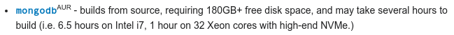

# Just Memes Telegram

*Because, as always, using what's already there it's not good for me.*
*I need to spend at least a year developing some kind of over engineered and barely working software.*

*TL:DR* [click here](https://t.me/justmemes69lmao)

## The beginning

A couple of years back, while wasting my time scrolling between Reddit and some weird telegram channel full of memes, I realized that this was not enough.
I wasn't living my life as a massive meme consumer the way I wanted.

By combining my infinite love for telegram bots and my pathological, meme fuelled, procrastination I have finally created this abomination of a software.

*I could finally cherry pick the sources of my own procrastination!*
*I could finally filter out the memes that I didn't like!*
*I could finally customize the source of my own demise, regulating how edgy/dank/wholesome each meme was!*

## The code

In order to achieve what I am describing, I had to:

1. Get the memes from somewhere
2. Filter out the meta memes
3. Filter out all the reposts
4. Filter out memes that referenced anything outside the scope of the channel
5. Keep track of what was posted, in order to avoid reposting my own posts

Point 1 was satisfied easily by using the Python library called Praw.
It gives a simple and easy to use interface to Reddit.

Point 2 to 4 were *(unsurprisingly)* harder to implement.
It took me a longer while but after poking around and desperately researching on Stack Overflow and Google I found some tools that allowed me to achieve this ambitious goal: Tesseract and ImageHash (more on that later).

Point 5 had a simple solution (a database, either SQL or NoSQL) but I found *(obviously)* a more convoluted and less efficient solution.
More on that later on, as well.

### Memes fetching

Memes fetching is simply achieved by logging into Reddit using [Praw](https://praw.readthedocs.io/en/stable/) and reading the stream made by some subreddits.
Then, for each submission, non image-links, video links, self texts and stickied posts must be filtered.
*Et voilà les mèmes sont récupérés!* (sorry.)

It took me a while to find a list of suitable subreddits.
This might look like a simple task, but finding the perfect balance between dankness, wholesomeness and relatability might not be that immediate after all.
After many experiments I think I found the perfect mix.

### Memes filtering

If you are an habitual Reddit user, you will know that some memes are either auto-referential (in the likes of *"Reddit good! Instagram bad!"*) or make sense only in the context of the website (like *"Read the tile* or sporadic references to a certain user and its karma).
Furthermore, you will also find that there are *a lot of reposts*.

In order to filter out the unwanted memes, I initially started to remove submissions whose titles contain some *"skip words"* like, for example, *"karma"* and *"upvote"* (among terms that make sense only inside Reddit itself).
This, however, turned out as insufficient since most memes include text.

This is where the first tool comes in play: [Tesseract](https://opensource.google/projects/tesseract).
It's a program (developed by Google itself) made solely to OCR images, by identifying and exporting the text inside them.

It works... *okay*, but it's good enough for purpose of meme filtering.
There are multiple ways in this could be improved, but there's no much need.
The text recognition is pretty flawed but as long as I need some really basic functionality, there's no need to do so.

Then, the next step was preventing reposts.

I used [ImageHash](https://pypi.org/project/ImageHash/), a wonderful little Python library, to detect similar images.
I don't really understand how the algorithms work, but they produce a checksum that is similar with similar inputs.
By simply evaluating the difference in the hashes of two images, it's possible to determine how similar they look.

Another step closer to the goal.
This leaves us with only...

### Database

*Well...* this is by far the worst part of this project.
I did not publish the code earlier because, in total honesty, I felt ashamed.

I was storing all the data relative to old and discarded posts in JSON files.
Yes.
That's honestly bad and made the whole code look messier.

After watching a video about refactoring made by [Arjan Codes](https://www.arjancodes.com/), I finally decided the time had come.
I had to make this big step in order to stop being scared by databases.
I had to befriend them, in orde to steal all their secrets.
I had to start using a real database.

Then, started I looking into the various database paradigms. SQL or NoSQL?

SQL would probably have made more sense, but since the data is very little and already in a structure that is similar to something that can be represented via JSON, the choice fell on the latter.
I have worked with MongoDB before, so it didn't take long to choose the DBMS.

It wasn't hard to convert all the code, since the data I am saving can be easily converted into JSON.
By making use of the new Python 3 `dataclass` classes, the jump into the "future" *(MongoDB came out in 2009, so what?)* was nothing more than a couple of hours *(and about 150 commits)* away.

#### Installing MongoDB

I'll leave this as a image.
I should have read the wiki more carefully.

I use arch, by the way.

## The output

If you survived until here, thank you.
I hope you have found this write up interesting!

You can find the Telegram channel [here](https://t.me/justmemes69lmao).
*Yep, that's a cringy name. No, I'm not ashamed.*

The bot has been running for more than two years now, spanning over multiple software iterations.
I don't think there's much room for improvements right now, but I'll see what can be done in the future!

In the meantime, enjoy some memes.
A new meme every 30 minutes!

## License

This repo is distributed under GNU GPG 3 license.
